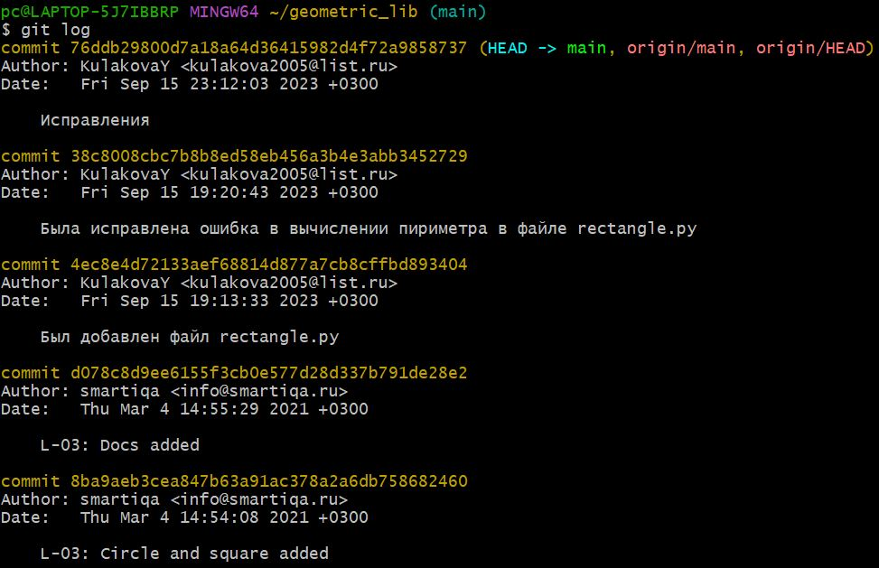

# Math formulas
Библиотека содержит функции вычисления периметра и площади различных фигур: круг, прямоугольник, квадрат, треугольник.
## Area
- Circle: S = πR²
  
Принимает значение радиуса окружности и возвращает её площадь
>Пример вызова функции:

>print (area(3)) - вызов функции со значением 3

>28.274333882308138 - полученное значение
- Rectangle: S = ab
  
Принимает значения длинн сторон прямоугольника и возвращает его площадь
>Пример вызова функции:

>print(area(2,3)) - вызов функции со значениями 2 и 3

>6 - полученное значение
- Square: S = a²
  
Принимает значение стороны квадрата и возвращает его площадь
>Пример вызова функции:

>print(area(5)) - вызов функции со значением 5

>25 - полученное значение
- Triangle: S = ah/2
  
Принимает значение длинны стороны и высоты треугольника и возвращает его площадь
>Пример вызова функции:

>print(area(4,2)) - вызов функции со значениями 4 и 2

>4.0 - полученное значение

## Perimeter
- Circle: P = 2πR
  
Принимает значение радиуса окружности и возвращает её периметр
>Пример вызова функции:

>print (perimeter(6)) - вызов функции со значением 6

>37.69911184307752 - полученное значение
- Rectangle: P = 2a + 2b
  
Принимает значения длинн сторон прямоугольника и возвращает его периметр
>Пример вызова функции:

>print(perimeter(3,1)) - вызов функции со значениями 3 и 1

>8 - полученное значение
- Square: P = 4a

Принимает значение длинны стороны квадрата и возвращает его периметр
>Пример вызова функции:

>print(perimeter(2)) - вызов функции со значением 2

>8 - полученное значение
- Triangle: P = a + b + c
  
Принимает значения длинн сторон треугольника и возвращает его периметр
>Пример вызова функции:

>print(perimeter(6,6,5)) - вызов функции со значениями 6, 6 и 5

>17 - полученное значение

## История изменения проекта 

