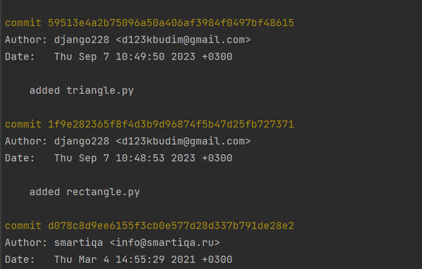

# Math formulas
## Area
- Circle: S = πR²
- Rectangle: S = ab
- Square: S = a²

## Perimeter
- Circle: P = 2πR
- Rectangle: P = 2a + 2b
- Square: P = 4a

# Functions 

### Area
    def area(r):
        Возвращает значение площади окружности с радиусом r
        r - радиус окружности

    Пример запуска:
        area(3) --> 28,27

### Perimeter
    def perimeter(r):
        Возвращает значение периметра окружности с радиусом r
        r - радиус окружности
    
    Пример запуска:
        perimeter(2) --> 12,57

### Area

    def area(a, b):
        """
        Возвращает произведение двух чисел a и b
        """

     Пример запуска:
        area(3, 2) --> 6

### Perimeter
    def perimeter(f, b):
        """
        Возвращает значение периметра прямоугольника со сторонами f и b
    
        :param f: одна сторона
        :param b: вторая сторона
        :return: 2*(f + b)
        """

    Пример запуска:
        perimeter(3, 4) --> 14

### Area
    def area(a):
        """
        Возвращает значение площади квадрата со стороной а
        :param a: сторона квадрата
    
        """
        return a * a

    Пример запуска:
        area(2) --> 4

### Perimeter 
    def perimeter(a):
        """
        Возвращает значение периметр квадрата со стороной а
        :param a: сторона квадрата
    
        """
        return 4*a

    Пример запуска:
        perimeter(2) --> 8

### Area
    def area(a, h):
        """
        Возвращает значение площади треугольника
        :param a: сторона треугольника
        :param h: высота треугольника
    
        """
        return a * h / 2

    Пример запуска:
        area(3, 4) --> 6

### Perimeter
    def perimeter(a, b, c):
        """
        Возвращает значение периметра треугольника
    
        :param a: первая сторона треульгольника
        :param b: вторая сторона треугольника
        :param c: третья сторона треугольника
    
        """
        return a + b + c

    Пример запуска:
        perimeter(3, 4, 5) --> 12

