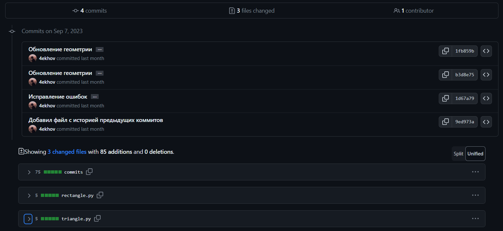

## Документация geometric_lib

### Общее описание
Библиотека предоставляют пользователю возможность оптимизировать некоторые геометрические действия.
В библиотеке представлены функции, позволяющие находить площадь и периметр для таких геометрических фигур, как:
окружность, треугольник, квадрат, прямоугольник.

### Описание функций с примерами вызова
В файле **circle.py** представлены функции area, perimeter;

**area**, на вход принимает радиус окружности (тип данных int), возвращает её площадь (тип данных float)
> from circle.py import area
> 
> radius = 10
> 
> area_result = area(radius) # << 10
> 
> print(area_result) # >> 314.1592653589793

**perimeter**, на вход принимает радиус окружности (int), возвращает её периметр (float)
> from circle.py import perimeter
> 
> radius = 10
> 
> perimeter_result = perimeter(radius) # << 10
> 
> print(perimeter_result) # >> 62.83185307179586

В файле **rectangle.py** представлены функции area, perimeter;

**area**, на вход принимает 2 стороны прямоугольника (int, int), возвращает его площадь (int)
> from rectangle.py import area
> 
> a = 2
> b = 5
> 
> area_result = area(a, b) # << 2, 5
> 
> print(area_result) # >> 10

**perimeter**, на вход принимает 2 стороны прямоугольника (int, int), возвращает его периметр (int)
> from rectangle.py import perimeter
> 
> a = 2
> b = 5
> 
> perimeter_result = perimeter(a, b) # << 2, 5
> 
> print(perimeter_result) # >> 14

В файле **square.py** представлены функции area, perimeter;

**area**, на вход принимает сторону квадрата (int), возвращает его площадь (int)
> from square.py import area
> 
> a = 10
> 
> area_result = area(a) # << 10
> 
> print(area_result) # >> 100

**perimeter**, на вход принимает сторону квадрата (int), возвращает его периметр (int)
> from square.py import perimeter
> 
> a = 10
> 
> perimeter_result = perimeter(a) # << 10
> 
> print(perimeter_result) # >> 40

В файле **triangle.py** представлены функции area, perimeter;

**area**, на вход принимает основание и высоту треугольник (int, int), возвращает его площадь (float)
> from triangle.py import area
> 
> a = 4
> h = 2
> 
> area_result = area(a, h) # << 4, 2
> 
> print(area_result) # >> 4.0

**perimeter**, на вход принимает три стороны треугольника (int, int, int), возвращает его периметр (int)
> from triangle.py import perimeter
> 
> a = 3
> b = 4
> c = 5
> 
> perimeter_result = perimeter(a, b, c) # << 3, 4, 5
> 
> print(perimeter_result) # >> 12

### История изминения проекта

**Хэши коммитов**
* 1d67a7980730290f6f88eb9eb5082f6258bee988 (HEAD -> new_features_409445, origin/new_features_409445) Исправление ошибок
* b3d8e7506d630f8fd74d6cd45a0c6aeb9519ddce Обновление геометрии
* 1fb859bd99cea022c928e23bd6afdd3fa3dfb3d6 Обновление геометрии
